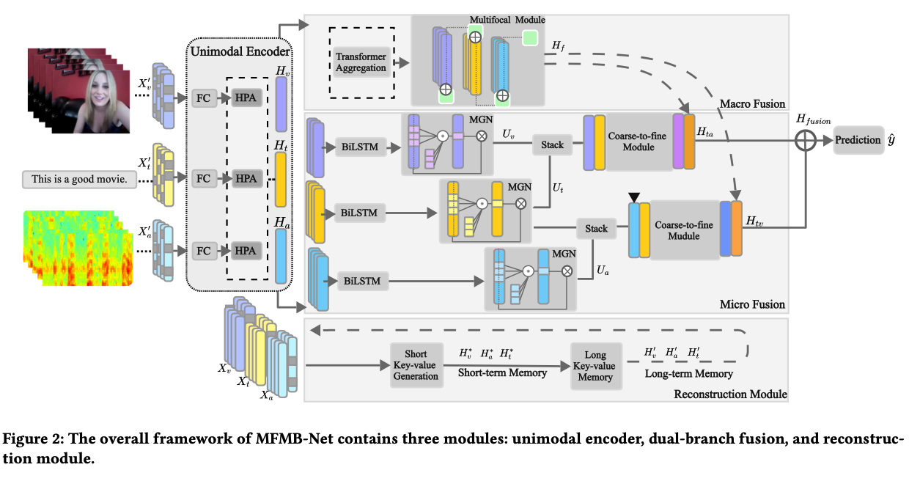

> Official Pytorch Implementation of "A Multi-Focus-Driven Multi-Branch Network for Robust Multimodal Sentiment Analysis"



## Table of Contents
- [Setup](#setup)
- [Download Datasets](#download-datasets)
- [Train](#train)
- [Acknowledgments](#acknowledgments)

## Setup
Python version >= 3.8
```bash
pip install -r requirement.txt
```

## Download Datasets
Provide public Multimodal Sentiment Analysis Datasets by Google Cloud Drive

- [CMU-MOSI](https://arxiv.org/abs/1606.06259): https://drive.google.com/drive/folders/1mGDZe5ZAcb3kmrQjvpCjANcS9Nq-nEvy

- [CMU-MOSEI](https://aclanthology.org/P18-1208): https://drive.google.com/drive/folders/1OTmRiJ00gG4u2JIujLpsJh-cJdVDLvXc

- SIMS
> download from [Baidu Yun Disk](https://pan.baidu.com/share/init?surl=XmobKHUqnXciAm7hfnj2gg) [code: `mfet`] or [Google Drive](https://drive.google.com/drive/folders/1A2S4pqCHryGmiqnNSPLv7rEg63WvjCSk)  
> **Notes:** Please download new features `unaligned_39.pkl` from [Baidu Yun Disk](https://pan.baidu.com/share/init?surl=XmobKHUqnXciAm7hfnj2gg) [code: `mfet`] or [Google Drive](https://drive.google.com/drive/folders/1A2S4pqCHryGmiqnNSPLv7rEg63WvjCSk), which is compatible with our new code structure. The `md5 code` is `a5b2ed3844200c7fb3b8ddc750b77feb`.

Modify `config/config_regression.py` to update dataset pathes.

## Run

```
sh test.sh
```

